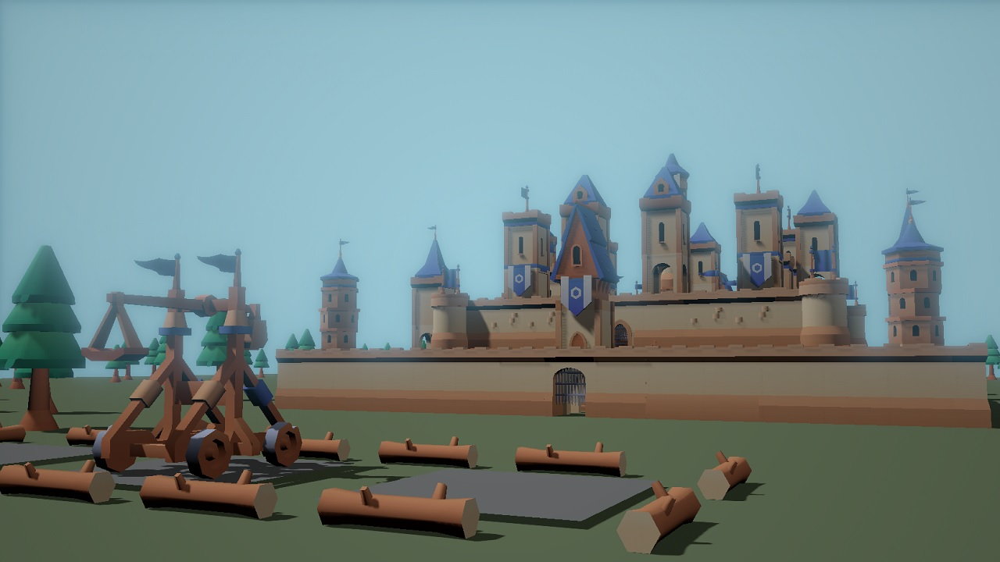
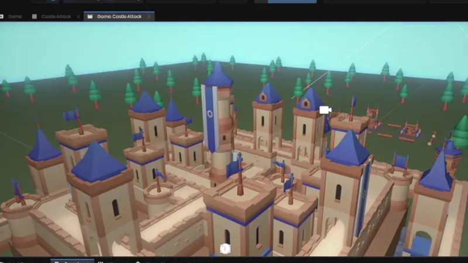

# Castle Crash

A small destruction minigame 🏰

- [Play Now](#play-now)
- [Description](#description)
- [Development history](#development-history)
- [Controls](#controls)
- [Used assets](#used-assets)
- [Problems and Improvements](#problems-and-improvements)
- [How did you make that / How does it work / How can I edit it](#how-did-you-make-that--how-does-it-work--how-can-i-edit-it)

## Play Now

You can try the game yourself in [s&box here - castle_crash](https://sbox.game/scrappycocco/castle_crash/).

## Description

This is a destruction minigame and tech-demo made for the [Tech Jam 1](https://sbox.game/c/tech1). It is my first s&box project. The idea was to build a complete but minimal game for others to see, try and eventually use as example for some parts.

In this minigame you can build, alone or with other players, 3 siege machine each. You can choose between a Catapult and a Trebuchet. They fire a different projectile at different speeds, as in real life the Trebuchet projectile is bigger and much heavier. You can rotate the siege machine left/right and change the fire power, which allow you to fire closer/farther.

The objective would be to destroy every single castle piece (_but that take too much time, so I doubt anyone is going to do it because the game is not so balanced towards that_).

For performance reasons the debris disappear after only 5s, it was cool to have a pile of debris, but the framerate sadly wouldn't like so many complex rigid-bodies moving around. This is also because some models have 100+ debris when demolished, this was cool during the first tests, and I wanted to keep it like that for a sort of realism. As you can easily imagine with something as 3-5 debris for model it would run better.

## Development history

I read about the [Tech Jam 1](https://sbox.game/c/tech1) on [Twitter](https://x.com/garrynewman/status/1872222504464314807) around Christmas 2024, but at the time I did not pay much attention to it.
It was during the first days of 2025 that I began seriously thinking about what I could make.

The only problem was that I **never touched** the Source Engine, Garry's Mod or s&box before, so I had to start completely from scratch. To help myself with the learning process, little pieces of this project are copied/inspired by [Facepunch battlebugs minigame](https://github.com/Facepunch/sbox-battlebugs), as the mouse input logic or the general waiting-playing-result GameState.
<ins>I recommend every new developer to check out Facepunch's example as they provide some nice insights about how to develop some parts.</ins> This is true especially now during the Developer Preview that the documentation is not very complete or up-to-date about examples on how to do some parts.

Thinking and browsing [Kenney's assets](https://kenney.nl/assets/category:3D) I decided to do some destruction with the Castle Kit. At this point I had lots of ideas: maybe you can build your own castle; or you must destroy each other's castle, built or not vs the AI or another player; or maybe the castle is going to be randomly generated.

Doing the firsts destruction tests, I understood that the easiest thing to do with the time I had was everyone attacking a single castle together, and so I implemented that. I must admit half of the demanding work was creating, importing, and setting up the models correctly.

There have been multiple logic changes about the projectile/destructible logic, some of which are written in the [Wiki](https://github.com/ScrappyCocco/castle-crash/wiki), as well as some example of how some things could have been done or what could be added, but I was not interested in doing for this mini-project.

The project was developed in ~30h during my free time.

## Controls

Most of the game is played using the mouse, there are a few keys you can use:

- Mouse Left Click: Click all the UI buttons and select the tiles to build to;
- Mouse Right Click: De-Select the currently selected tile;
- Keyboard <kbd>F</kbd>: Enable the free movement Camera to look around (while playing) - unfortunately can't be rotated;
- Keyboard <kbd>R</kbd>: Disable the free movement Camera and resets it to the original player view (while playing);
- Keyboard <kbd>W</kbd>/<kbd>A</kbd>/<kbd>S</kbd>/<kbd>D</kbd>: Move the free movement Camera around.

You should be able to check the input and view or change the keys in s&box.

## Used assets

All assets used are from [Kenney's assets](https://kenney.nl/assets/category:3D) and free to use under the Creative Commons CC0 license.

You can find a summary of the used in the [ASSETS](ASSETS.md) file.

## Problems and Improvements

The game is not perfect as it was made for a Jam in a little time with an Engine I am not familiar with.

If you want to report a problem, or if you want to improve it with a new feature, a fix, or a new map, free to open an Issue, a PullRequest or a Discussion.

**Remember the game was developed with the developer preview of s&box and might break or no longer be playable in the future.**

## How did you make that / How does it work / How can I edit it

I wrote a little documentation about the project in the [Wiki](https://github.com/ScrappyCocco/castle-crash/wiki).

It might not be up to date with s&box documentation or api.
If you don't find what are you looking for feel free to open an Issue or a Discussion and ask!

